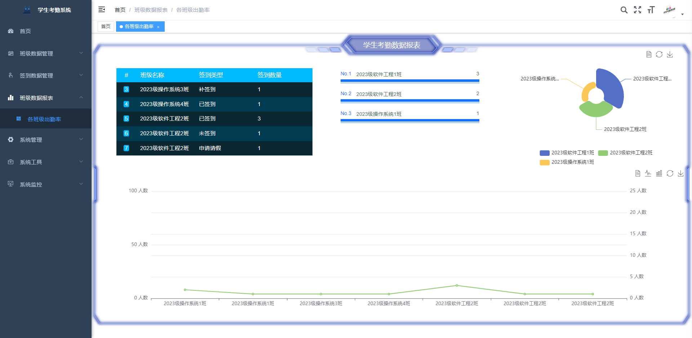
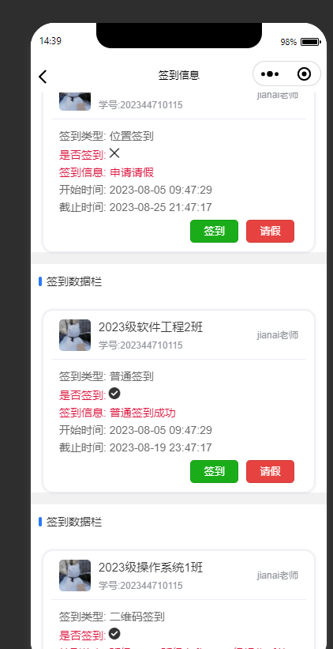
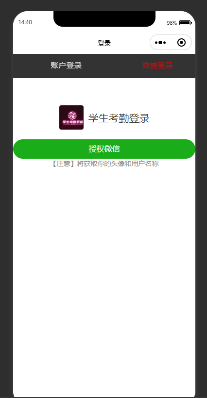
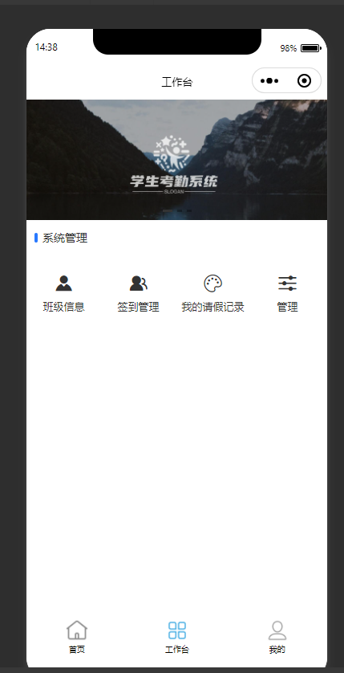
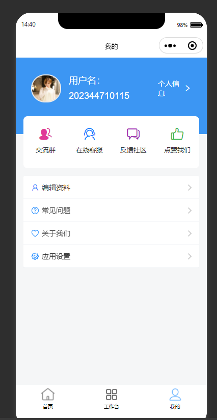

# 学生考勤管理系统

#### 项目介绍
基于Ruoyi+uniapp （前后端分离项目） 实现学生考勤系统
学生考勤（普通、位置、二维码签到）、以及可视化数据展示
微信小程序密码和微信授权登录都可以！

后期会不断优化、如果满意给个Star星吧！以此鼓励、谢谢支持呀！
需要源码+sql 联系我主页哦！

## 内置功能

1.  用户管理：用户是系统操作者，该功能主要完成系统用户配置。
2.  部门管理：配置系统组织机构（公司、部门、小组），树结构展现支持数据权限。
3.  岗位管理：配置系统用户所属担任职务。
4.  菜单管理：配置系统菜单，操作权限，按钮权限标识等。
5. 角色管理：角色菜单权限分配、设置角色按机构进行数据范围权限划分。
6. 通知公告：系统通知公告信息发布维护。

 
## 效果图展示

持续更新中......

## 账户密码
- admin/admin123 

### 学生考勤系统
1. 学生用户模块：用于录入和管理学生的基本信息，包括姓名、学号、班级、性别等。
2. 
3. 班级管理：用于管理学生所属的班级信息，包括班级名称、班级成员等。
4. 教师管理：对教师信息进行管理，包括教师的基本信息、职务等。
5.  教师模块--创建班级--分配学生--学生输入密码--校验老师设置密码--正确方可加入班级
6. 请假管理：提供学生请假功能，包括在线请假、请假审批和请假记录查询等。
7. 可视化模块 用于对考勤数据进行分析和统计，生成考勤报表，包括学生出勤率、请假次数、迟到次数等。
8. 二维码签到--教师发布二维码--学生扫码签到数据
9. 普通按钮签到

10.项目持续更新、优化中......

考勤记录管理：用于记录学生的考勤情况，包括请假、迟到、早退、缺勤等信息，并提供查询和统计功能。

